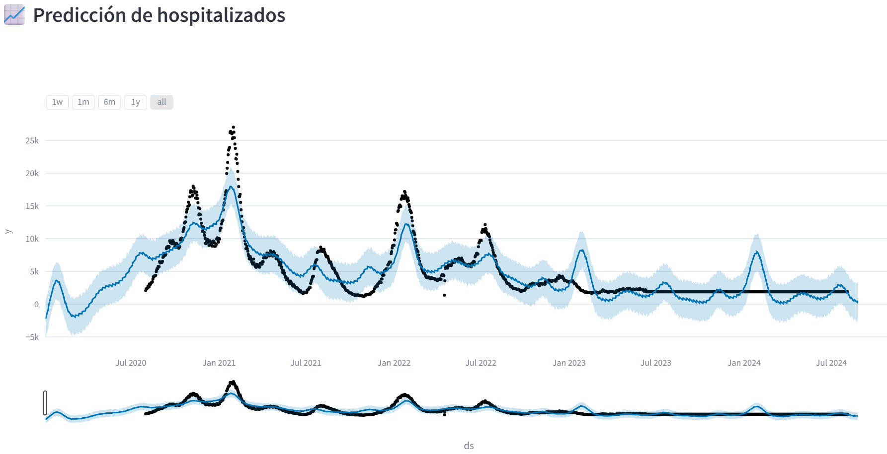

# 🏥 Predicción de Saturación Hospitalaria en España

Este proyecto desarrolla un sistema de **predicción de ocupación hospitalaria y en UCI** en España usando datos abiertos de [Our World in Data](https://ourworldindata.org/covid-hospitalizations).  
Incluye todo el pipeline de **Data Science**: **descarga y limpieza de datos, análisis exploratorio, modelado de series temporales** y un **dashboard interactivo en Streamlit**.

---

## 🚀 Características
- 📊 **Datos abiertos** actualizados desde Our World in Data.
- 🧹 **Procesamiento y limpieza** de valores faltantes con interpolación.
- 📈 **Análisis exploratorio** y visualizaciones interactivas.
- 🤖 **Modelo de predicción** usando [Facebook Prophet](https://facebook.github.io/prophet/).
- 🌐 **Dashboard interactivo** en [Streamlit](https://streamlit.io/) con gráficos en Plotly.

---

## 📂 Estructura del proyecto
```plaintext
hospital_capacity_prediction/
│
├── data/
│   ├── hospital_data_raw.csv          # Datos originales
│   └── hospital_spain_clean.csv       # Datos limpios
│
├── notebooks/
│   ├── 01_data_download.ipynb
│   ├── 02_data_cleaning.ipynb
│   ├── 03_exploratory_analysis.ipynb
│   ├── 04_model_training.ipynb
│   └── 05_real_time_prediction.ipynb
│
├── src/
│   └── hospital_model.pkl             # Modelo entrenado
│
├── dashboard/
│   └── app.py                         # Dashboard en Streamlit
│
└── requirements.txt
```

---

## 📊 Ejemplo de visualización


---

## ⚙️ Instalación y uso

1. Clonar el repositorio
```
bash
git clone https://github.com/fragompul/hospital_capacity_prediction.git
cd hospital_capacity_prediction
```

2. Crear entorno e instalar dependencias
```
pip install -r requirements.txt
```

3. Generar datos limpios (opcional si ya existen en /data)
```
import pandas as pd, os
url = "https://raw.githubusercontent.com/owid/covid-19-data/master/public/data/owid-covid-data.csv"
df = pd.read_csv(url)
df_es = df[df['location'] == 'Spain'][['date','hosp_patients','weekly_hosp_admissions','icu_patients','new_cases','new_deaths']]
df_es.interpolate(method='linear', inplace=True)
os.makedirs("data", exist_ok=True)
df_es.to_csv("data/hospital_spain_clean.csv", index=False)
```

4. Entrenar el modelo (opcional)

Ejecutar el notebook 04_model_training.ipynb.

5. Ejecutar el dashboard
```
cd dashboard
streamlit run app.py
```

Se abrirá en tu navegador en http://localhost:8501.

---

## 🧠 Tecnologías usadas
- **Python**: pandas, matplotlib, seaborn, plotly
- **Modelado**: Facebook Prophet
- **Dashboard**: Streamlit
- **Datos**: Our World in Data (COVID-19 Hospitalizations)

---

## 📌 Autor
- Francisco Javier Gómez Pulido
- Correo electrónico: frangomezpulido2002@gmail.com
- Linkedin: www.linkedin.com/in/frangomezpulido
- GitHub: fragompul
